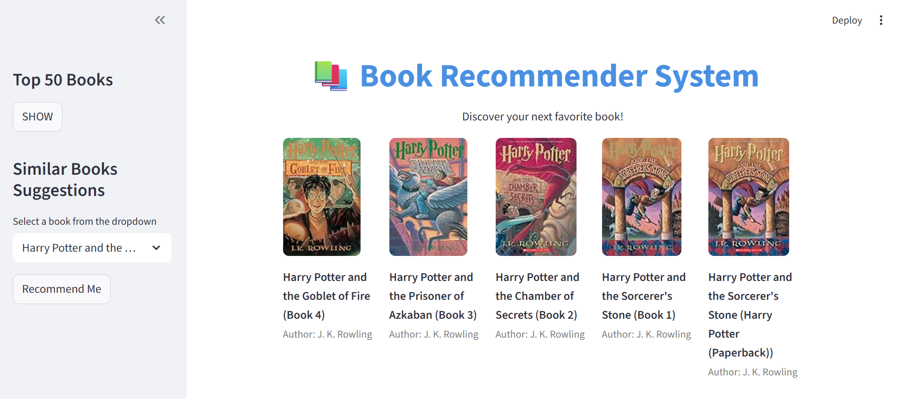

# Book Recommendation System

A Machine Learning powered web application that recommends books similar to the one selected by the user.

## Live Demo

## Live Demo

[Launch Web App](https://book-recommendation-akash.streamlit.app/)

## Project Preview



## Features

- Popular books section
- Personalized book recommendations
- Displays book covers and author names
- Interactive Streamlit UI
- Fast recommendation engine using similarity matrix

## Tech Stack

- Python
- Pandas
- NumPy
- Scikit-learn
- Streamlit
- Pickle

## How It Works

The system uses collaborative filtering and cosine similarity to recommend books related to the selected book.

## How to Run Locally

```bash
pip install -r requirements.txt
streamlit run app.py
```

## Future Improvements

- Search by author
- Better UI design
- Genre-based filtering
- User login system

## Author

Akash Kumar
